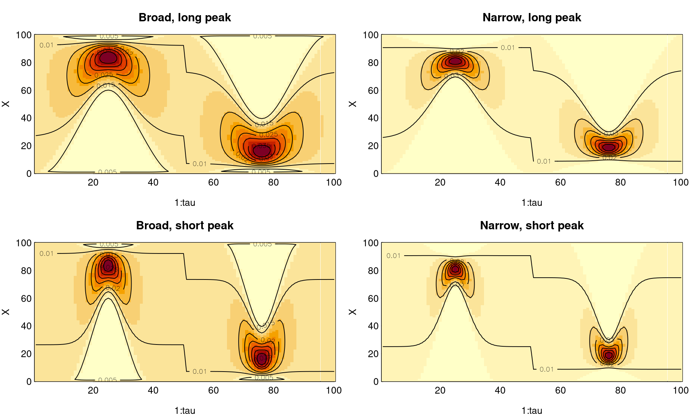
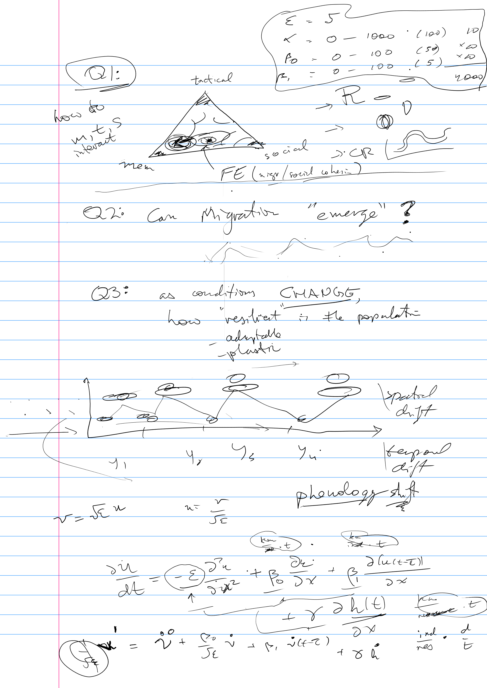

Modeling tactical and memory-driven migration in dynamic environments
========================================================
author: Sriya Potluri and Elie Gurarie
date: March 2021
autosize: true
transition: none
width: 1600
height: 900

Premise
========================================================

To optimally forage in a dynamic environment, you need both **tactical** responses (adapting to local changes in resource gradients), and **strategic** responses (using memory to guide long-term decisions). 

***

Model
========================================================

$${\frac{\partial u(x,t)}{\partial t}} = -\varepsilon {\frac{\partial^2 u(x,t)}{\partial x^2}} + \alpha \frac{\partial h(x,t)}{\partial x} + \sum_{i = 0}^n \beta_i \frac{\partial u(x, t - i\tau)}{\partial x}$$

- $\epsilon$: diffusion, exploration / search
- $\alpha$: taxis, resource followign
- $\beta_0$: cohesion, tendency to stick to group
- $\beta_1$: memory - tendency to do what was done previous year

Seasonal resource
========================================================

$$R(x,t, \theta) = \chi B(x/\chi, a(t, \theta), b(t, \theta))$$

<!-- make short--> 

1. The total amount constant.
2. At the beginning, middle, and end of the year the resource is uniformly distributed. 
3. At some peak time $t_r < \tau/2$, the resource concentrates at a location $x_r < \chi/2$ 
4. The resource peaks exactly symmetrically at time $\tau - t_r$ and location $\chi - x_r$ with the same variance $\sigma_r$.
(where $\tau$ is the length of the year and $\chi$ is the extent of the spatial domain)

Running the model 
==========================

- R package `deSolve` and `ReacTran` - fluid transport pde solvers.
- Functions all in `memorymigration` GitHub project. 
- SESYNC cluster 
- server-based Rstudio

Metrics
======================

1. Social Cohesiveness
2. Foraging Efficiency
3. Migratoriness

Metrics: Cohesiveness (problematic!)
==========================
$$SC = 1-\frac{\sqrt{12} \, }{X_{max}}\overline{\sigma}$$

$$\overline{\sigma} = {1\over \tau} \int \sigma_u(x,t) \,dt$$
where $$\sigma_u^2(t) = \int_D \left(x - \mu_u(t)\right)^2 \, u(x,t)\, dx$$

and $\mu_u$ is the mean of $u$ at time $t$.

Definition: The mean standard deviation of the population across the equilibrium year
Problem: For the skewed population distribution, standard deviation is not the best measure

***

Image

Metrics: Foraging Efficiency 
==========================
$$FE = {1\over \tau} \int_{0}^\tau \int_{0}^{X_{max}} \sqrt{u(x,t) \, h(x,t)} \, dx\,dt$$

Defintion: The Bhattacharyya Coefficient quantifies similarity between two distributions. We take the mean of the coefficient over the equilibrium year to determine foraging efficiency (FE)

Metrics: Migratoriness
========================
$$MI = 1-min(O(t_1, t_2))$$
$$O(t_1, t_2) = \int_D \sqrt{u(x, t_1) \, u(x, t_2)} \, dx $$

Definition: We calculate overlap of the population from two different times within the year, choosing those times to minimize the overlap, and reporting the overall overlap. We find the values of $t_1$ and $t_2$ that minimize $O$, corresponding to the periods of maximum distance. We subtract this minimum value to calculate migratoriness of the population

Questions that this model can answer: 
======================

Q1. What's the "best" parameter combination to maximize FE - how does that affect Migratoriness and Cohesiveness - under various resource scenarios.

Q2. Can migration emerge from a non-migratory initial condition? 

Q3. As conditions CHANGE, how resilient is the population at various Diffusion, Advection, Cohesion, Memory values?  
- spatial drift
- temporal drift
- increased variability

***

Preliminary results: 
================================

