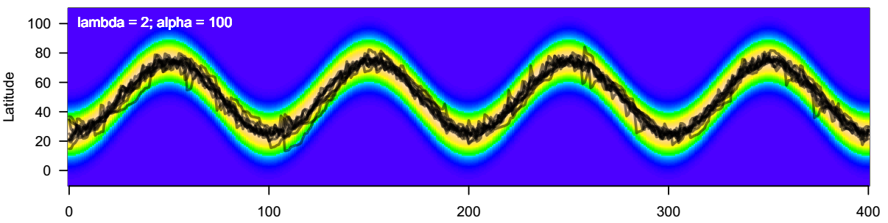
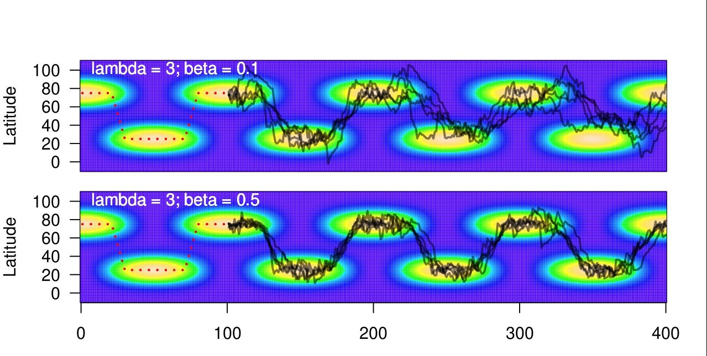
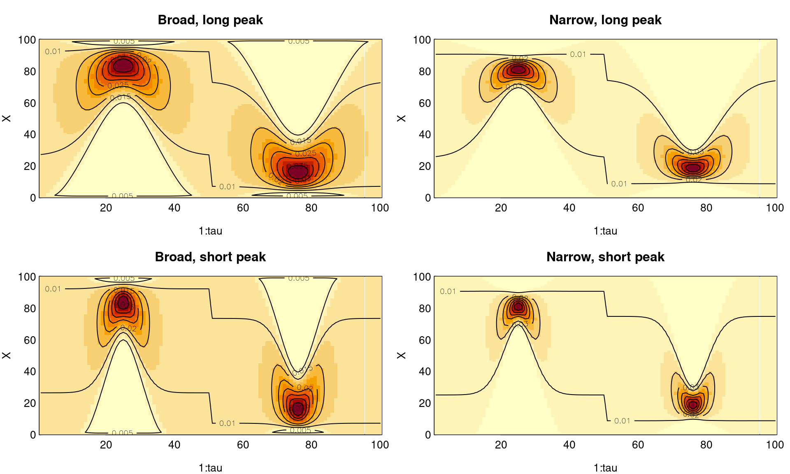
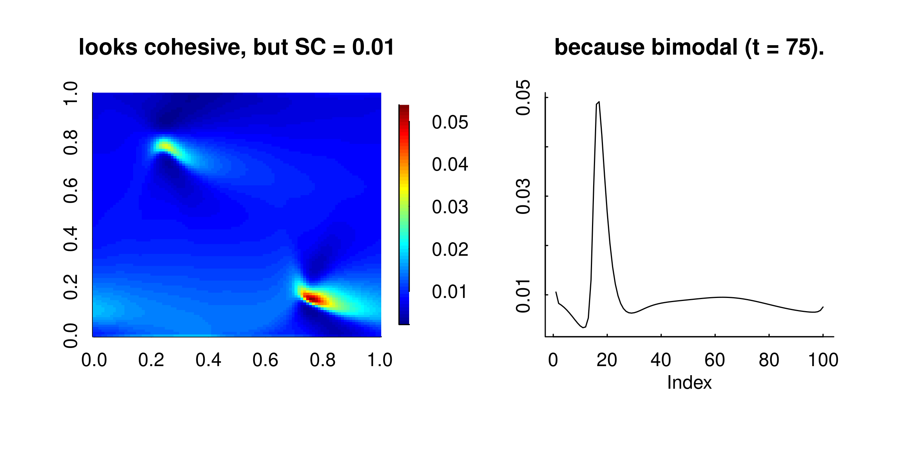
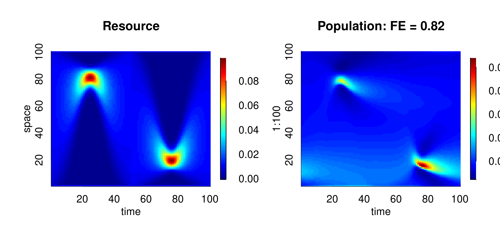
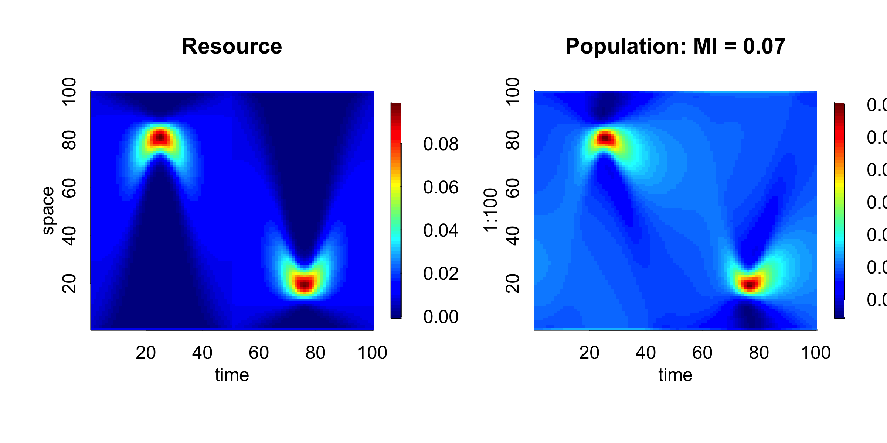
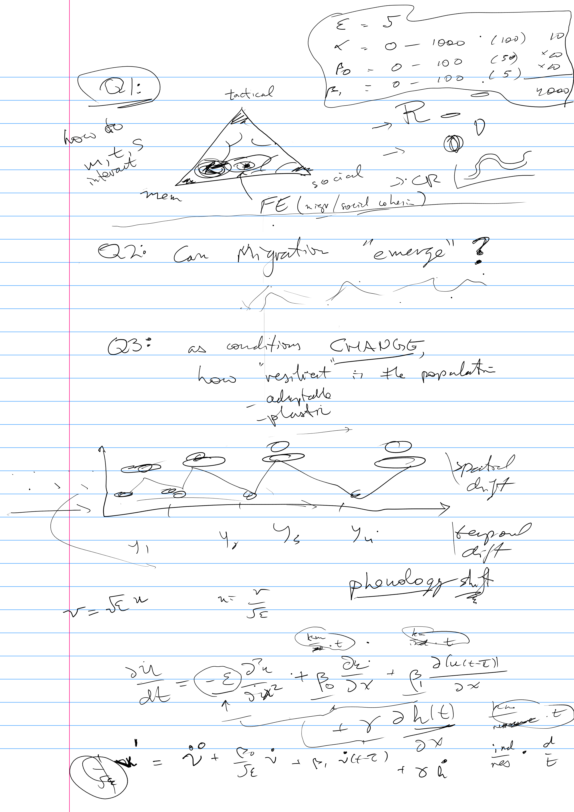
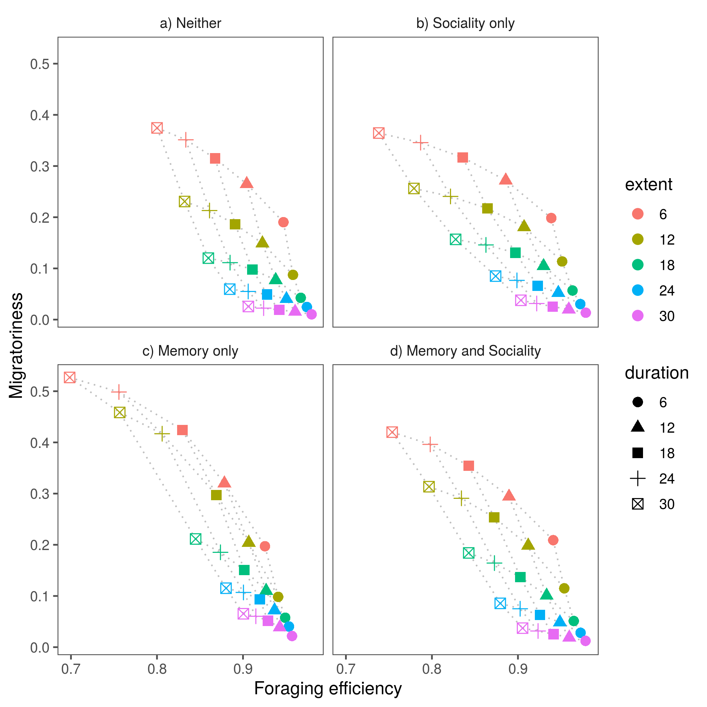

```{r setup, include=FALSE}
knitr::opts_chunk$set(echo = FALSE, cache = TRUE, message = FALSE, warning = FALSE)
```

# Premise
<div class='left' style='float:left;width:48%'>
To optimally forage in a dynamic environment, you need both **tactical** responses (adapting to local changes in resource gradients), and **strategic** responses (using memory to guide long-term decisions). 

</div>
<div class='right' style='float:right;width:48%'>
**Tactics**

{width=100%}

**Memory**


{width=100%}
</div>


# Model: Diffusion advection

$${\frac{\partial u(x,t)}{\partial t}} = -\varepsilon {\frac{\partial^2 u(x,t)}{\partial x^2}} + \alpha \frac{\partial}{\partial x}\left(u \frac{\partial h(x,t)}{\partial x}\right) + \sum_{i = 0}^n \beta_i \frac{\partial u(x, t - i\tau)}{\partial x}$$

- $\epsilon$: diffusion, exploration / search
- $\alpha$: taxis, resource following
- $\beta_0$: cohesion, tendency to stick to group
- $\beta_1$: memory, tendency to do what was done previous year

Builds on series of projects exploring "cognitive" variations chemotaxis (e.g. Fagan et al. 2017, 2019). 


# Seasonal resource

$$h(x,t, \theta) = \chi B(x/\chi, a(t, \theta), b(t, \theta))$$

<div class='left' style='float:left;width:48%'>
1. The total amount constant.
2. Between seasons, uniformly distributed. 
3. Resource concentrates symmetrically in time and space


Importantly: we explore a range of **spatial concentrations** and **temporal durations**.

</div>

<div class='right' style='float:right;width:48%'>
{width=100%}
</div>


---

**Running the model**

<div class='left' style='float:left;width:48%'>
- R package `deSolve` and `ReacTran` - fluid transport pde solvers.
- Functions all in `memorymigration` GitHub project. 
- SESYNC cluster 
- server-based Rstudio
</div>

<div class='right' style='float:right;width:48%'>

**Assessing the model**

Three metrics: 

1. Social cohesiveness
2. Foraging Efficiency
3. Migratoriness
</div>

# Metrics: Cohesiveness


<div class='left' style='float:left;width:50%'>

$$SC = 1-\frac{\sqrt{12} \, }{X_{max}}\overline{\sigma}$$

$$\overline{\sigma} = {1\over \tau} \int \sigma_u(x,t) \,dt$$
where $$\sigma_u^2(t) = \int_D \left(x - \mu_u(t)\right)^2 \, u(x,t)\, dx$$

and $\mu_u$ is the mean of $u$ at time $t$.

Definition: The mean standard deviation of the population across the equilibrium year

</div>

<div class='right' style='float:right;width:50%'>

```{r SC_example, fig.width = 4}
require(memorymigration)
data(resources)
par(mfrow = c(2,1), mar = c(3,3,3,1), mgp = c(2,.25,0), las = 1, tck = 0.01)

image(1:100,1:100,resource_R2, main = "SC = 0.36")
contour(1:100,1:100,resource_R2, add = TRUE)
#computeCohesiveness(resource_R2, world)

image(1:100,1:100,resource_R3, main = "SC = 0.11")
contour(1:100,1:100,resource_R3, add = TRUE)

#computeCohesiveness(resource_R3, world)
  
```

</div>

# Social Cohesiveness: Problem


For skewed of bimodal population distribution, standard deviation are a poor measure ...
$\epsilon = 8; \alpha = 200; \beta_0 = 500; \beta_1 = 0$

```{r badSCexample, cache = TRUE, fig.width = 10, eval = FALSE}
load("images/Sim1.rda")
png("images/BadSC.png", width = 2400, height = 1200, res = 300)
par(mfrow = c(1,2), bty  = "l", mgp = c(1.5,.5,0), tck = 0.01)
require(fields)
computeCohesiveness(sim[[length(sim)]], world)
image.plot(sim[[length(sim)]], main = "looks cohesive, but SC = 0.01")
snapshot <- sim[[length(sim)]][75,]
plot(snapshot, type = "l", main = "because bimodal (t = 75).", ylab = "")
dev.off()
```

{width=100%}

**Not sure how to deal with this ...**


# Metrics: Foraging Efficiency 


$$FE = {1\over \tau} \int_{0}^\tau \int_{0}^{X_{max}} \sqrt{u(x,t) \, h(x,t)} \, dx\,dt$$


**Bhattacharyya Coefficient** quantifies similarity between two distributions.


```{r, eval = FALSE}
load("images/Sim1.rda")
png("images/FEexample.png", width = 2400, height = 1200, res = 300)
par(mfrow = c(1,2), bty  = "l", mgp = c(1.5,.5,0), tck = 0.01)
require(fields)
image.plot(1:100, 1:100, resource_R2, main = "Resource", xlab = "time", ylab = "space")
image.plot(1:100, 1:100, sim[[length(sim)]], main = "Population: FE = 0.82", xlab = "time")
dev.off()

computeEfficiency(resource_R2, sim[[length(sim)]], world)
```

<center>
$\epsilon = 8; \alpha = 200; \beta_0 = 500; \beta_1 = 0$ 

{width=70%}
</center>

# Metrics: Foraging Efficiency - Issues


Seems to always be very high!

Also - assumes that there is some sort of space inhibition ... the actually highest efficiency is when animals pile in at indefinitely high density at the location of highest resource availability. 

<center>

{width=70%}

</center>

# Metrics: Migratoriness

$$MI = 1-min(O(t_1, t_2))$$
$$O(t_1, t_2) = \int_D \sqrt{u(x, t_1) \, u(x, t_2)} \, dx $$

Definition: MINIMUM OVERLAP of population at all possible pairs of times within year. 

```{r, eval = FALSE}
load("images/Sim1.rda")
png("images/MIexample.png", width = 2400, height = 1200, res = 300)
par(mfrow = c(1,2), bty  = "l", mgp = c(1.5,.5,0), tck = 0.01)
require(fields)
image.plot(1:100, 1:100, resource_R2, main = "Resource", xlab = "time", ylab = "space")
image.plot(1:100, 1:100, sim[[length(sim)]], main = "Population: MI = 0.07", xlab = "time")
dev.off()

computeEfficiency(resource_R2, sim[[length(sim)]], world)
```

<center>

$\epsilon = 8; \alpha = 200; \beta_0 = 500; \beta_1 = 0$
{width=70%}

</center>

# Questions that this model can answer: 

<div class='left' style='float:left;width:60%'>

Q1. How does **memory** and **sociality** influence **migratoriness** and **foraging efficiency** under different **resource dynamics**? 

Q2. How long does it take for migration to emerge from a non-migratory initial condition? 

Q3. As conditions CHANGE, how resilient is the population at various Diffusion, Advection, Cohesion, Memory values?  
- spatial drift
- temporal drift
- increased variability

</div>

<div class='right' style='float:right;width:40%'>

{width=100%}

</div>


# Example simulations:


```{r, out.width = "33%", eval = FALSE}
include_graphics(c("images/Sim_withMemory.png","images/Sim_onlyMemory.png", "images/Sim_noMemory.png"))

``` 

1. Only Tactics
1. Memory and Sociality
2. Only Memory
3. Only Sociality


# Some results  

<div class='left' style='float:left;width:55%'>

1. Migratoriness results from **concentrated** and **long** resource pulses. 
2. Migratoriness is **increased** by **memory**, but **attenuated** by **sociality**. 
3.  Foraging is easiest (obviously) for **diluted** and **short** resource pulses, as the resource is distributed mainly uniformly. 

</div>

<div class='right' style='float:right;width:45%'>

{width=100%}

</div>

# Take-aways

1. This is a convenient, flexible and fast tool for exploring a wide range of dynamics
