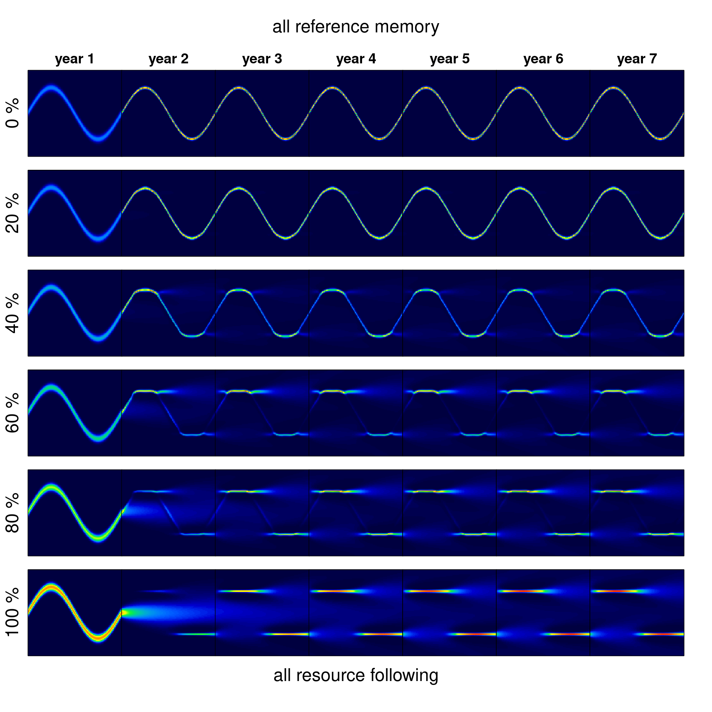

```{r setup, include=FALSE}
knitr::opts_chunk$set(echo = FALSE, cache = TRUE, message = FALSE, warning = FALSE, eval = FALSE)
```

# Introduction

Seasonal migrations are extremely widespread among terrestrial, aquatic, avian and invertebrate species [@Dingle2014].  For many species, migration is an extremely successful strategy, allowing a far greater number of individuals to inhabit landscape which might not otherwise be able to support large numbers year round [@Fryxell1996]. The ultimate evolutionary cause of seasonal migration, essentially, is that the energetic and survival related costs of migration are outweighed by the fitness benefits of accessing suitable seasonal resources, whether those are for energetic gain, predator avoidance, a suitable physical, biotic or social environment for reproduction [@Avgar2013]. 

Much as the ultimate causes of migration vary across species, the proximate causes, drivers and mechanism can vary considerably across and even within species [@Shaw2016]. Some migrants follow a "green wave" of spring vegetation as it flowers across altitudinal or latitudinal gradients [@Bischof2012;@Kolzsch2015]. These migrations can be considered "tactical", as they can occur - as an extreme simplification - purely as  response to local conditions.   Other migrants perform long-distance migrations in anticipation that critical resources will be available at the time of arrival at the end point of migration (**refs**).  This second behavior involves the greatest trade-off between the costs of migration against the benefits of accessing resources, whether food, suitable habitat for breeding, or predator refuge, that are highly seasonal and localized (**refs**).  This approach can be considered "strategic" in the sense that it is driven not by immediate cues but by a remembered anticipation [@Bracis2017].

Migratory species are often considered to be more vulnerable to environmental change, as a disruption in either of the seasonal ranges or along a migratory corridor can have significant negative impacts [@Wilcove2008;@Kauffman2021].  On the other hand, it has been argued that migratory species might be more resilient to disruptions due to their wide-ranging mobility [@Robinson2009]. Clearly, the ability to perform a migration without local cues in only possible if the behavior is hard-cued or remembered.  On the other hand, a strictly programmed behavior can be maladaptive if conditions change. 

Here, we explore the relationship between memory and resource following for a migratory population under various static and dynamic seasonal resource distributions using a diffusion-advection model.  

Diffusion-advection models have a long pedigree in animal movement modeling [@Skellam1951;@Turchin1998;@Okubo2001]. These models are grounded in the general idea that animal movements - somewhat like movements of physical particles - combine a random (diffusive) component with a directed (advective) component. While direct relationships between diffusion models and movement data are somewhat tenuous [@Gurarie2011a], as a theoretical tool for exploring processes they are invaluable for their versatility and the relative ease of numeric computation of the partial differential equations (PDEs) that are used to describe diffusion-advection models mathematically. Thus, much theoretical and some applied work has been done on refining the basic assumptions of diffusion models, e.g. by including heterogeneity in populations [@Skalski2003;@Gurarie2009], fat-tailed dispersal kernels [@Kot1996], non-linear or otherwise complex responses to resources and consepecifics (**refs**).  

Perhaps the greatest difference between animals and randomly moving passive particles described by diffusion models is cognition, including social behavior and memory. Refinements to diffusion-advection equations have revealed conditions under which non-local information gathering [@Fagan2017] and behavioral switching may confer foraging advantages [@Fagan2019], in particular when resources are dynamic and patchy. The interacting role of memory and sociality, in contrast, have been comparatively little studied. 

We anticipate that under many conditions a blending of *tactical* (i.e. direct response to resource availability or perception) and *strategic* (i.e. memory-driven and forward-thinking) behavior help foragers navigate dynamic, seasonal resource environments.  


# Methods

## Memory movement model

In designing our study, our goal was to develop a minimal heuristic in which the following processes were explicitly modeled: (1) Random or exploratory movement, (2) attraction to resources, (3) a long-term (or *reference*) memory of large-scale movement behavior, (4) a short-term (or *working*) memory that updates movement behavior based on recent experience, (5) some social aspect to the learned behavior.  

A diffusion-advection equation provided a computationally efficient and versatile framework for examining just such a system.  We consider a population moving in one dimension in a constrained domain ${\cal D}$ and distributing itself according to the following equation: 

$${\frac{\partial u(x,t)}{\partial t}} = -\varepsilon {\frac{\partial^2 u(x,t)}{\partial x^2}} + 
\alpha \frac{\partial}{\partial x}\left(u(x,t) \frac{\partial h(x,t)}{\partial x}\right) + v_m(x, t,y)
$$

where  $u(x,t)$ represents the population distributed in time and space, $\varepsilon$ is the diffusion rate and $h(x,t)$ is the distribution of the resource.  The resource is structured and seasonal with period $\tau$, such that $h(x, t) \approx h(x, t-\tau)$. $\alpha$ represents the strength of advection in the direction of the resource $h(x,t)$ gradient, as standard in chemotaxis equations.  Finally, there is the social memory based speed term $v_m(x,t,y)$, which evolves with the year $y \in \{0,1,2,...\}$, i.e. the count of periods $\tau$: $y = \lfloor t/\tau \rfloor$.  

The social memory term works as follows:  The population retains a memory of the mean location of the population exactly one year prior, i.e. $\widehat{u}(t-\tau)$, where $\hat{\,}$ operator signifies the expected value of the population distribution. This working memory is combined with a baseline reference memory, $\widehat{u_o}(t)$ via:

$$\widehat{u_m}(t) = \kappa^y \, \widehat{u_o}(t) + \left(1-\kappa^y\right)\,\widehat{u}(t-\tau)\,\,\,\,(2)$$

The long-term, reference memory term, which does not change throughout the evolution of the process, can be thought of a strictly periodic function.  The parameter $\kappa \in (0,1)$ is the relative contribution of that long-term memory. When $\kappa = 0$, all of the actionable memory is from the preceding year, when $\kappa = 1$, the actionable memory is entirely the reference memory.  Importantly, the individuals remember not just the location of the actionable memory term, but the movement rate of that term as well, i.e. $d\widehat{u_m}(t)/dt$.  

The overarching behavior of the population is to attempt to repeat that memory.  Thus the memory speed of the population at $x = \widehat{u_m}(t)$ is $du_m(t)/dt$; if $du_m/dt > 0$ and $x < \widehat{u_m}(t)$, i.e. for those animals that are lagging behind the optimal remembered location, the memory speed is greater than $du_m(t)/dt$, and if $x > \widehat{u_m}(t)$ the speed is somewhat lower, to allow the remainder of the population to catch up. 

The specific relationship is a logistic curve: 

$$v_m(t) =  \begin{cases}
\frac{\lambda}{1 + \exp((x - x_+)/\beta)}  &  \frac{d\widehat{u_m}}{dt} > 0\\
\frac{\lambda}{1 - \exp(-(x - x_-)/\beta)} & \frac{d\widehat{u_m}}{dt} < 0
\end{cases}$$

where $x_+$ and $x_-$ are fixed such that the value of $v_m(x,t) = d{u_m}/dt$ at $x = \widehat{u_m}$. 

$$
x_+ = \widehat{u_m} - \log\left(\lambda / \frac{d\widehat{u_m}}{dt} - 1\right) \beta \\
x_- = \widehat{u_m} + \log\left(-\lambda / \frac{d\widehat{u_m}}{dt} - 1\right) \beta
$$


The model is confined to a one-dimensional bounded domain $[-\chi,\chi]$, with no flux outside of the boundaries i.e. ${\frac{\partial u(-\chi,t)}{\partial t}} = {\frac{\partial u(\chi,t)}{\partial t}} =0$.  Thus the total population is fixed at all times - there are no birth or death processes - and found within the domain.   Furthermore, the parameters remain constant throughout time.  Our interest is entirely in the ability of a fixed set of memory and movement parameters to ``navigate'' a dynamic and changing environment. 

<!--
A few special cases of this model have been studied in the past. @Shigesada1979 (section 3) thoroughly analyzed the resource following diffusion model with no memory and a static resource (i.e.~$\beta = 0$ and $h(x,t) = h(x)$), showing that at equilibrium, the log of the population density is proportional to $h(x)/\alpha$.  @Shi2019 consider a single period memory model ($\kappa = 0$) in detail, with the addition of an independent birth-death process. Importantly, the authors prove the wellposedness (existence, uniqueness, and positivity) of this model, with arguments that are equally valid for our model. @Fagan2017 numerically explored an extension of this model with no memory but a dynamic resource and the addition of non-local information, i.e.~a model where the resource $h(x,t)$ is "perceived" via a convolution with a detection function. @Fagan2019 added a behavioral switching behavior to the non-local information model.  This study 
--> 

 
## Seasonal resource

We ran our numerical experiments on a spatial domain $x \in [-100,100]$, and a periodicity $\tau = 100$ (i.e.~100 day years).  We were interested in an approximately periodic resource dynamic, i.e. one in which $h(x,t \approx h(x, t-\tau))$. We generated two types of resource distributions. A "non-surfable" resource (*island resource*), and weakly surfable resource (*drifting resource*).  Both are characterized by a peak in time and space centered at $M_x$ at $m_t$, and $-m_x$ at $\tau - m_t$ (for example, locations 40 and -40 at times 25 and 75, respectively). These pulses have a shared time scale of duration $s_t$ and a spatial scale of extent $s_x$, the standard deviation in the time and space dimension respectively.  The island resource is simply two uncorrelated bivariate normal distributions $$h(x,t) = K\,(\Phi(m_x, m_t, s_x, s_t) + \Phi(-m_x, \tau - m_t, s_x, s_t))$$
where the normalizing constant $K$ is selected such that the average total amount of resource throughout the year is 1, i.e. ${1 \over \tau} \int_T\int_X h(x,t) dx\,dt = 1$. 

The drifting resource differs from the island resource in that the total amount of resource at any given time point is 1.  This property is attained by distributing the resource as a re-scaled beta distribution, where the shape and scale parameters vary sinusoidally in such a way as to make the standard deviations and means match the desired values of $m_x, m_t, s_x, s_t$ (see appendix for details). 

Within a given year, the resource is entirely symmetric: $h(x,t) = h(-x, \tau-t)$.  However, in scenarios exploring climate change we allow the peaks to vary with drift and stochasticity according to:  $m_x(y) \sim {\cal N}(\mu_x + \beta_x\,y, \sigma_x)$ and $m_t(y) \sim {\cal N}(\mu_t + \beta_t\,y, \sigma_t)$, where the $\mu$, $\beta$ and $\sigma$ terms are the mean, slope and variance, respectively, for the location and time duration of the pulse.  Thus, if $\beta=0$ and $\sigma=0$, the conditions are constant across years, and if $\beta_x > 0$ there is a drift of the resource towards extremes, if $\beta_t < 0$ there is a shift towards earlier resource pulses.  These trends mirror the poleward shift of peak resources and the earlier spring phenology occurring with a warming global climate.  In the scenarios we explore, the spatial scales ($s_x$ and $s_t$) remain constant.  

## Metrics

The main metrics we are interested are *migratoriness* and *foraging efficiency*.  The migratoriness is measured as the maximum distance between the median of the population distribution within a given year.  The median is a more reliable metric than the mean, as even as distributions become highly assymetric - pulling the mean in one directon or another - the median can  remain consistently in the middle of the spatial domain indicating a net flux of animals of 0. This is the anticipated (and realized) result of a purely "tactical" model pursuing the periodic resource pulses. 

To quantify the foraging efficiency, i.e., the organisms’ ability to track the distribution of the resources over space and time, we use a continuous form of the Bhattacharyya Coefficient [@Bhattacharyya1943] which quantifies the similarity between two distributions.  We compute this coefficient at every time point in a given year, and take the mean across the equilibrium year to determine foraging efficiency (FE). Thus, the foraging efficiency index is: 
$$FE = {1\over \tau} \int_{0}^\tau \int_{0}^{\chi} \sqrt{u(x,t) \, h(x,t)} \,\, dx\,dt$$
where the spatial integral is taken over the domain.  This metric is constrained to be between 0 and 1.  

For simulations with a constant resource, we run those until a quasi-equilibrium state is achieved, i.e. where the Bhattacharya index of the population distribution across subsequent years reaches a value of 0.9999.  Once that state is attained, we compute the mirgatoriness and foraging efficiency metrics, and additionally collect the number of years that were required to reach stationarity.  

For numerical runs with climate change, we run the simulation for 30 years, since equilibrium is never achieved) and retain the foraging efficiency for the final 10 years, reflecting something like the dynamic long-term average of the system's ability to keep track of climate change. 


We also record the actual memory. 

## Simulation studies

We numerically solved this model using numerical differencing of a system of ordinary differential equations (ODE's) approximating the PDE in equation (2) with the Runge-Kutte algorithm using the `deSolve` [@Soetaert2010] and `ReacTran` [@Soetaert2012] packages in R.  

We assessed a wide range of parameter values and resource geometries and dynamics with the goal of answering the three main questions. 

Q1. What 

# Results



{width=50%}

# Discussion

1. The model seems to - approximately - work for exploring this dynamic.
2. It is - however - difficult to make it really repeat previous behavior strongly. I was hoping for a "knob" that perfectly replicates past behavior, but the diffusion-taxis formulation makes that somehow hard.  I haven't programmed longer time scaled memories (> 1 year) but that would probably be helpful / interesting. 
3. The memory bit does demand iteratively feeding a year's cycle back into it rather than having some analytical function, which slows the whole thing down a bit. That said, with deepthought a lot of runs could be fitted simultaneously - and I tend to be very picky about "slow" - it actually only takes about 6 seconds to run a 6 year hybrid model on a 100 x 100 spatio-temporal grid.  But sometimes, the results are more numerically stable on a finer grid. 
4. We need a metric of success!  And also - somehow - a metric of "migratoriness". 
5. What questions do we wnat to explore?  I think a big one is adaptability of the model under different kinds of resource perturbations, e.g. if the timing shifts, or location shifts.


Our model is somewhat similar to an evolutionary individual-based model [@Anderson2013], which showed that some inherent phenotypic plasticity is required to hedge both against persistent trends and increased stochasticity of resource distributions, but at the risk of sub-optimal access to resources [@Anderson2013].  


# References

