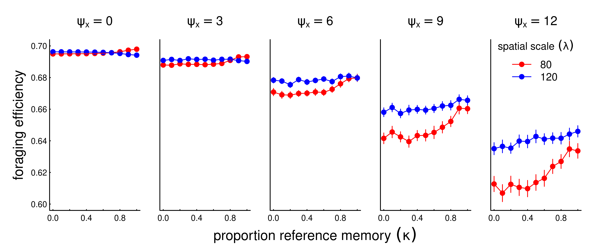

```{r setup, include=FALSE}
knitr::opts_chunk$set(echo = FALSE, cache = TRUE, message = FALSE, warning = FALSE, eval = TRUE)
```


# Abstract

*to do.*

# Introduction

Seasonal migrations are extremely widespread among terrestrial, aquatic, avian and invertebrate species [@Dingle2014].  For many species, migration is an extremely successful strategy, allowing a far greater number of individuals to inhabit landscape which might not otherwise be able to support large numbers year round [@Fryxell1988]. The ultimate evolutionary cause of seasonal migration, essentially, is that the energetic and survival related costs of migration are outweighed by the fitness benefits of accessing suitable seasonal resources, whether those are for energetic gain, predator avoidance, a suitable physical, biotic or social environment for reproduction [@Avgar2014]. 

Much as the ultimate causes of migration vary across species, the proximate causes, drivers and mechanism can vary considerably across and even within species [@Berthold1999;@Shaw2016]. Some migrants follow a "green wave" of spring vegetation as it flowers across altitudinal or latitudinal gradients [@Bischof2012;@Kolzsch2015]. These migrations can be considered "tactical", as they can occur - as an extreme simplification - purely as response to local conditions.   Other migrants perform long-distance migrations in anticipation that critical resources will be available at the time of arrival at the end point of migration [@Abrahms2019].  This second behavior involves the greatest trade-off between the costs of migration against the benefits of accessing resources, whether food, suitable habitat for breeding, or predator refuge, that are highly seasonal and localized.  This approach can be considered "strategic" in the sense that it is driven not by immediate cues but by a remembered anticipation [@Bracis2017].

Migratory species are often considered to be more vulnerable to environmental change, as a disruption in either of the seasonal ranges or along a migratory corridor can have significant negative impacts [@Wilcove2008;@Kauffman2021].  On the other hand, it has been argued that migratory species might be more resilient to disruptions due to their wide-ranging mobility [@Robinson2009]. Clearly, the ability to perform a migration without local cues is only possible if the behavior is hard-programmed or remembered.  On the other hand, a strictly programmed behavior can be maladaptive if conditions change. Because the scenarios underlying migration are multifold and complex, mathematical modeling may provide some insights and help clarify where, when, and under what conditions we might expect different kinds of migrations to operate. 

Diffusion-advection models have a long pedigree in animal movement modeling [@Skellam1951;@Turchin1998;@Okubo2001]. These models are grounded in the general idea that animal movements - somewhat like movements of physical particles - combine a random (diffusive) component with a directed (advective) component. While direct relationships between diffusion models and movement data are somewhat tenuous [@Gurarie2011], as a theoretical tool for exploring processes they are invaluable for their versatility and the relative ease of numeric computation of the partial differential equations (PDEs) that are used to describe diffusion-advection models mathematically. Thus, much theoretical and some applied work has been done on refining the basic assumptions of diffusion models, e.g. by including heterogeneity in populations [@Skalski2003;@Gurarie2009], fat-tailed dispersal kernels [@Kot1996], non-linear or otherwise complex responses to resources and consepecifics.  

Perhaps the greatest difference between animals and randomly moving passive particles described by diffusion models is cognition, including social behavior and memory. Refinements to diffusion-advection equations have revealed conditions under which non-local information gathering [@Fagan2017] and behavioral switching may confer foraging advantages [@Fagan2019], in particular when resources are dynamic and patchy. The interacting role of memory and sociality, in contrast, has been comparatively little studied. 

Here, we develop a diffusion-advection model with memory to explore the resilience of a migratory population under various dynamic, seasonal resource distributions.  In formulating the model, our goal is to identify the minimum set of movement and memory parameters required to generate an adaptive, migratory behavior. This includes the ability to learn to migrate from non-migratory initial conditions, simulating the release of naive animals in a seasonal environment [@Jesmer2018], or to lose the propensity to migrate if the resource distribution does not require it, also a commonly observed phenomenon [@Wilcove2008].  Our ultimate goal is to assess the role of long and short-term memory in the resilience (or fragility) of a migratory population against changing resource distribution dynamics, including both variability or trends in resource distribution or phenology reflecting climate change. 

We anticipate that under many conditions a blending of *tactical* (i.e. direct response to resource availability or perception) and *strategic* (i.e. memory-driven and forward-thinking) behavior will help foragers navigate dynamic, seasonal environments.  Over-reliance on either strategy should be maladaptive.  We further anticipate that a shorter-term memory updating is needed to navigate trends in resource spatial distribution and temporal distribution (phenology), but that a longer-term reference memory is needed to navigate resource distributions that are stochastic (see also @Lin2021).

# Methods

## Memory movement model

In designing our study, our goal was to develop a minimal heuristic in which the following processes were explicitly modeled: (1) Random or exploratory movement, (2) attraction to resources, (3) a long-term (or *reference*) memory of large-scale movement behavior, (4) a short-term (or *working*) memory that updates movement behavior based on recent experience, and (5) some social aspect to the learned behavior.  
A diffusion-advection equation provided a computationally efficient and versatile framework for examining just such a system.  We consider a population moving in one dimension in a constrained domain $D$ and distributing itself according to the following equation: 

$${\frac{\partial u}{\partial t}} = -\varepsilon {\frac{\partial^2 u}{\partial x^2}} + 
\alpha \frac{\partial}{\partial x}\left(u \frac{\partial h}{\partial x}\right) + 
\beta \frac{\partial}{\partial x}\left(v_s(u)\right) + 
v_m(t)
$$

where  $u$ represents the population distributed in time and space.  The first term is the diffusion term, capturing the fast time-scale exploration and "random" movements of individuals, with $\varepsilon$ is the diffusion rate.  

The second term represents the attraction to a dynamic resource $h$, with the proportionality of the advection to the gradient of the resource given by the parameter $\alpha$ (note, the population and resource distributions are functions of both space and time $u(x,t)$ and $h(x,t)$ - we omit the dependent variables in the notation for brevity).  This is the well-studied standard chemotaxic resource-following behavior. We borrow the general notation from our earlier related work [@Fagan2017;@Fagan2019]. 

The third term captures the collective or social advection term of the population via a non-local, density dependent function $v_s(u,x)$.  If this function takes the form of a convolution around a non-local kernel $k$, i.e.~
$$v_s(u) = k(x) * u(x)$$
and that kernel is odd, an attractive or "swarming" behavior can be generated [@Mogilner1999]. We use the kernel analyzed by @Mogilner1999: 
$$k(x) = \frac{x}{2\lambda^2} \exp(-x^2/2\lambda^2).$$ 
The convolution of $u$ with this kernel has the property of pushing the population in a positive direction when $x < \widehat{u}$, and in a negative direction when $x > \widehat{u}$.  The parameter $\lambda$ is a length scale of sociality - roughly one-half the size of the "swarm", where $\beta$ is a parameter that quantifies the overall strength of sociality. 

Finally, the last term captures the direct advection that emerges from a memory-driven migratory behavior. This term evolves with a set of parameters $\theta_y$ that slowly change each year $y \in \{0,1,2,...\}$, i.e. the count of periods $\tau$: $y = \lfloor t/\tau \rfloor$.  

The migration speed is specified by six parameters $\theta$: the timing of the start and duration of two anticipated seasons (nominally, winter and summer) $t_1$, $dt_1$, $t_2$, $dt_2$, and the spatial coordinates of the population centroid for each season $x_1$ and $x_2$.  Thus the remembered migratory speed term is a simple step function given by:

$$
v_m(t, \theta_y) = \begin{cases}
0; & t > t_1  \,\, \text{and} \,\, t \leq t_1 + dt_1 \\ 
s_{12}; & t > t_1 + dt_1 \,\, \text{and} \,\,  t \leq t_2 \\ 
0; & t> t_2 \,\, \text{and} \,\, t \leq t_2 + dt_2 \\ 
s_{21}; &  t > t_2+dt_2 \,\, \text{or} \,\, t \leq t_1\\ 
\end{cases}
$$

  where the migration speeds $s_{12}$ and $s_{21}$ from the respective ranges are set such that they arrive at $x_1$ at $t_1$, leave at $t = t_1 + dt_1$, arrive at $x_2$ at $t = t_2$, i.e. $s_{12} = \frac{x_2-x_1}{t_2 - (t_1 + dt_1)}$ and $s_{21} =  \frac{x_1-x_2}{t_1 - (t_2 - \tau + dt_2)}$.  This step-like migration function is a one-dimensional version of the migration parameters estimated in empirical studies for individuals [@Gurarie2017] and, more relevantly, for populations [@Gurarie2019] in empirical studies. 

We consider these six parameters to be the known or remembered determinants of the migratory behavior, with an initial set $\theta_0$ determining the reference migration behavior. This reference migration is updated each year by the experience of the population. To perform this updating, we estimate a new set of parameters $\widehat{\theta_y}$ after each year, and combine these new parameters with the reference parameters according to the following weighted mean:

$$\theta_{y+1} = \kappa^y \, \theta_o + \left(1-\kappa^y\right)\,\widehat{\theta_y}$$
where each of the six parameters is updated identically. The estimates $\widehat{\theta_y}$ are obtained via a least-squares minimization of the migration track ($m(t,\theta) = \int_0^t v_m(t',\theta_y) \, dt'$) against the spatial mean of the population process in year $y$ (i.e. $\widehat{u}(t) = \int_X u_y(t, x) dx$).  The parameter $\kappa \in (0,1)$ captures the reliance on that long-term memory. When $\kappa = 0$, all of the actionable memory is from the preceding year.  When $\kappa = 1$, the actionable memory is entirely the reference memory.  

The model is confined to a one-dimensional bounded domain $[-\chi,\chi]$, with no flux outside of the boundaries i.e. ${\frac{\partial u(-\chi,t)}{\partial t}} = {\frac{\partial u(\chi,t)}{\partial t}} =0$.  As there are no birth or death processes, the total population remains fixed and constant, for convenience integrating to 1.  Furthermore, the parameters remain constant throughout time, with no adaptation or mutation-selection process.  Our interest is entirely in the ability of a fixed set of memory and movement parameters to ``navigate'' an intra- and interannually dynamic, seasonal environment. 

<!-- A few special cases of this model have been studied in the past. @Shigesada1979 (section 3) thoroughly analyzed the resource following diffusion model with no memory and a static resource (i.e.~$\beta = 0$ and $h(x,t) = h(x)$), showing that at equilibrium, the log of the population density is proportional to $h(x)/\alpha$.  @Shi2019 consider a single period memory model ($\kappa = 0$) in detail, with the addition of an independent birth-death process. Importantly, the authors prove the well-posedness (existence, uniqueness, and positivity) of this model, with arguments that are equally valid for our model. @Fagan2017 numerically explored an extension of this model with no memory but a dynamic resource and the addition of non-local information, i.e.~a model where the resource $h(x,t)$ is "perceived" via a convolution with a detection function. @Fagan2019 added a behavioral switching behavior to the non-local information model.  The essential innovation of our study is the inclusion of an explicit, slowly-varying migratory advection term.

**Figure 1.** *Illustration of memory-based velocity term as a logistic function of space (x-axis), mean memory ($\widehat{u_m}(t)$ - vertical dashed line) and mean movement rate ($d\widehat{u_m}/dt$ - horizontal dashed line). Various values of the social spatial scale parameter $\beta$ reflects the maximum slope of the logistic curve such that at small values of the spatial scale, there is a steep difference in the speed around the mean location (blue curve), and at large values of the spatial scale, there as a weak response of the speed to the mean location.  In all cases, at locations beyond the mean, the speed is lower than at locations lagging behind the mean.*
-->


## Seasonal resource

We solved the model numerically on a spatial domain $x \in [-100,100]$, and a periodicity $\tau = 100$ (i.e.~years of 100 days). We were interested in an approximately periodic resource dynamic, i.e. one in which $h(x,t \approx h(x, t-\tau))$. We generated two types of resource distributions. A "non-surfable" resource (*island resource*), and weakly surfable resource (*drifting resource*).  Both are characterized by a peak in time and space centered at $m_x$ at $m_t$, and $-m_x$ at $\tau - m_t$ (for example, locations 30 and -30 at times 25 and 75, respectively). These pulses have a shared time scale of duration $s_t$ and a spatial scale of extent $s_x$, the standard deviation in the time and space dimension respectively.  The island resource is simply two uncorrelated bivariate normal distributions $$h(x,t) = K\,(\Phi(m_x, m_t, s_x, s_t) + \Phi(-m_x, \tau - m_t, s_x, s_t))$$
where $\Phi$ is the bivariate Gaussian distribution function, and the normalizing constant $K$ is selected such that the average total amount of resource throughout the year is 1, i.e. $\frac{1}{\tau} \int_T\int_X h(x,t) dx\,dt = 1$. 

The drifting resource differs from the island resource in that the total amount of resource at any given time point is 1 ($\int_X h(x,t) dx = 1$).  This property is attained by distributing the resource as a re-scaled beta distribution, where the shape and scale parameters vary sinusoidally in such a way as to make the standard deviations and means match the desired values of $m_x, m_t, s_x, s_t$ (see appendix for details).  Both types of resources are illustrated in Figure 1. 

Within a given year, the resource is entirely symmetric: $h_y(x,t) = h_y(-x, \tau-t)$.  However, in scenarios exploring climate change we allow the peaks to vary with drift and stochasticity according to:  $m_x(y) \sim {N}(\mu_x + \beta_x\,y, \sigma_x)$ and $m_t(y) \sim {N}(\mu_t + \beta_t\,y, \sigma_t)$, where the $\mu$, $\beta$ and $\sigma$ terms are the mean, slope and variance, respectively, for the location and time duration of the pulse.  Thus, if $\beta=0$ and $\sigma=0$, the conditions are constant across years, if $\beta_x > 0$ there is a drift of the resource towards extremes, if $\beta_t < 0$ there is a shift towards earlier resource pulses.  These trends mirror the pole-ward shift of peak resources and the earlier spring phenology occurring with a warming global climate.  The spatial scales ($s_x$ and $s_t$) remain constant in all of our simulations.  


**Figure 1. Examples of various seasonal resource distribution functions, contrasting short duration, but wide pulses ($\sigma_t = 3, \sigma_x = 12$; left panels), long duration but spatially concentrated pulses ($\sigma_t = 12, \sigma_x = 3$; right panels), and isolated resource pulses (upper panels) from the weakly drifting resource (lower panels).  The total amount of resource is identical across all scenarios. In the weakly drifting resources, the total amount is constant at all times, and uniform in the middle of the phase (time = 0, 50, 100).**


## Metrics

The main metrics we are interested in are *migration mismatch*, *foraging efficiency* and *adaptation to trends*.  

Migration mismatch captures the similarity between the migration phenology and the resource phenology. To do this, we compute the total mismatch, i.e. is a sum of the difference between the migration coefficients and the resource peaks.  Thus, the spatial mismatch is given by the absolute difference between the migration targets and the resource peaks, i.e. $MM_x = |x_1 - m_x| + |x_2 + m_x|$.  The temporal mismatch is the difference between the arrival time and the peak of the resource if arrival is post-peak, the difference between the departure time and the peak of the resource if departure is pre-peak, and 0 if the seasonal duration spans the peak, i.e.  $MM_t = max\{t_1 - m_1, m_1 - (t_1 + dt_1), 0\} + max\{t_2 - m_2, m_2 - (t_2 + dt_2), 0\}$. The total mismatch is the sum of $MM_x$ and $MM_t$.  A mismatch of less than 1 is essentially perfect, we consider a mismatch of 1-5 to be "good", and beyond 30 the system can be said to have failed to keep up with climate change. 

To quantify the foraging efficiency, i.e., the organisms’ ability to track the distribution of the resources over space and time, we use a continuous form of the Bhattacharyya Coefficient [@Bhattacharyya1943] which quantifies the similarity between two distributions.  We compute this coefficient at every time point in a given year, and take the mean across the equilibrium year to determine foraging efficiency (FE). Thus, the foraging efficiency index is: 
$$FE = \frac{1}{\tau} \int_{0}^\tau \int_{-\chi}^{\chi} \sqrt{u(x,t) \, h(x,t)} \,\, dx\,dt$$
where the spatial integral is taken over the domain.  This metric is constrained to be between 0 and 1.  

For simulations with a constant resource, we ran the model until a quasi-equilibrium state was achieved, i.e. where the Bhattacharya index of the population distribution across subsequent years reached a value of 0.9999.  Once that state was attained, we computed the migration mismatch and foraging efficiency metrics, as well as the number of years required to reach stationarity.  

For numerical runs with climate change, we first run a simulation for 20 years to attain an equilibrium, and then begin shifting the location of the resource with a trend (slow 0.25, medium 0.5, or rapid 1 units per year), or by adding stochasticity (s.d. 3, 6, 12).  For the trend analyses, we then compute the slope of the migration location parameter against the resource drift and refer to this as the *spatial adaptation* (SA) index. 

## Simulation studies

We explored this model using numerical differencing of a system of ordinary differential equations (ODE's) approximating the PDE in equation (2) with the Runge-Kutte algorithm using the `deSolve` [@Soetaert2010] and `ReacTran` [@Soetaert2012] packages in R.  We additionally used the `nlsLM` function in package `minpack.LM` [@minpack.lm] for robust and fast annual estimation of the migration parameters.  The complete code is available as an R package (`memorymigration`) available on GitHub at https://github.com/EliGurarie/memorymigration and as an interactive Shiny application at https://url.to.be.determined. 

We assessed a wide range of parameter values and resource geometries and dynamics with the goal of answering the four main questions: 1. Can this model adapt to a discrete shift in peak resource location and timing?  What is the relative role of memory and sociality for adaptation?  2. Can this model acquire a migratory behavior from a non-migratory initial condition?   3. What is the role of a reference memory for dealing with stochastic resource dynamics?  4. Can this model adapt when the resource peaks shifts in space?  


**Table 1** *Parameters, variables and metrics.*

|| Parameter   | Description |
|-----| ----------- | ----------- |
| *Memory migration model* 
|| $\epsilon$  | Diffusion | 
|| $\alpha$  | Forage following | 
|| $\beta$  | Strength of sociality |
|| $\lambda$  | Spatial scale of sociality |
|| $\kappa$  | Proportion of reference versus working memory |
|| $x_1$, $x_2$  | location of population centroids in summer and winter| 
|| $t_1$, $dt_1$  | start and duration of summer season |
|| $t_2$, $dt_2$  | start and duration of winter season | 
|| $\kappa$ | proportion memory allocated to reference (long-term) memory vs. short-term memory|
| *Resource dynamics* 
|| $\tau$  | duration of period (year) | 
|| $m_x$, $-m_x$  | spatial coordinate of resource peak for summer and winter | 
|| $m_t$, $\tau - m_t$  | timing of resource peak for the summer and winter | 
|| $\sigma_x$, $\sigma_t$   | time duration and and spatial scale of resource pulse | 
|| $dx$, $dt$  | rate of change of peak locaton and timing of resource | 
|| $\psi_x$, $\psi_t$  | standard deviation of peak location and timing | 
| *Metrics* 
|| $MM_x$  | spatial migration mismatch |
|| $MM_t$  | temporal migration mismatch |
|| $TE$  | total mismatch |
|| $FE$  | foraging efficiency |
|| $SA$  | spatial adaptation index |


# Results


**Figure 2.** *Example of adaptation to a shift in resource peak. The initial (year 0) behavior migrates to locations 50 and -50 at days 15 and 60, whereas the resource peak is at 30 and -30, peaking at times 25 and 75.  The panels show (a) the first 14 years of the simulation; (b) the centroid of the annual movement of the population is shown in panel b, with dark blue to red colors indicating year 0 to year 40; (c) annual foraging efficiency across years; (d) migration timing parameters for each year, with orange segments indicating arrival and departure from the summering (northern) grounds, and the blue segments indicating timing of arrival and departure at the wintering grounds; (e) migration arrival and departure location across years, with blue and orange indicating winter (southern) and summer (northern) locations.*

## Adaptation to resource phenology

The ability of this system to attain stable, migratory state that matches the dynamics of the resource is illustrated in Figure 2. In the illustrated scenario, it takes nearly 40 years to attain an equilibrium, and the eventual steady state is one where the centroid of the migration lines up exactly with the centroid of the resource, and the arrival timing coincides with the *peak* of resource availability.  Notably, the path to this equilibrium is somewhat indirect, with the later winter range taking more time to stabilize than the earlier summer range.  The eventual steady state is one where the foraging efficiency is relatively high. 

We ran this process for 8100 parameter combinations (Figure 3). The fundamental dynamic of attaining and maintaining a well-matched migration phenology, can occur under many combinations of parameter values, but all parameters play a role. Among the more intuitive results are that greater values of $\alpha$ (resource following) lead to an improved ability to match the migration.  Resource peaks with larger spatial extent (higher $\sigma_x$) are generally better for migration matching.  A larger set of parameters matched migration with low diffusion than high diffusion. 

Less intuitive was the high importance of the sociality parameters, in particular the spatial scale of the swarming.  Higher levels of social attraction ($\beta$) led to improved migration matching except in those cases where the sociality scale $\lambda$ was high.  Thus, for example, at $\lambda = 20$, no simulations at $\beta >= 200$ managed to acquire or maintain a matched migration.  However, at $\lambda = 50$ or $100$, the migration was slightly better matched at high values of $\beta$.  (Fig. **X**)  The spatial extent of the swarm was a remarkably significant variable.  Smaller swarms were able to match migration only at low values of social attraction ($\beta = 200$), and relatively high values of resource attraction ($\alpha \geq 600$).  

Random forest analyses, whether on the log of total mismatch or on the classification of a perfect match, uniformly show that the most important variables [@Breiman2001] were $\alpha$ and $\lambda$ (4.14 and 4.02 proportional increase in MSE), and the least important was $\sigma_t$, with a 0.5 proportional increase (table **X**). 

Overall, foraging efficiency was strongly correlated with migration matching, as expected.  At high mismatch (> 50), foraging efficiency was low (mean 0.29, s.d. 0.16) compared to the near-perfect matching migrations (mean 0.58, s.d. 0.14).  However, somewhat higher mismatch (1 to 5) showed an even higher overall foraging efficiency (mean 0.62, s.d. 0.18 - see also Figure **X**). 


```{r, echo = FALSE, eval = FALSE}
load("../results/stability/stability_compiled.rda")
require(plyr)
df <- stability %>% mutate(mismatch = cut(TE, c(0,1,5,50,300)))
ddply(df, "mismatch", summarize, mean(FE), sd(FE))
```


**Figure 3.** *Migration phenology matching across six model parameters. Low and high diffusion ($\epsilon = 1$ and $8$ in upper and lower panel blocks), tight, medium and loose swarms ($\lambda = 20, 50, 100$) left to right panels.  Within each of these blocks, high values of the resource following parmaeters $\alpha$ from 0 to 1000 are left to right, and higher values of the sociality parameter $\beta$ are bottom to top.  Within each of the combinations of $\epsilon, \lambda, \alpha, \beta$, we show results ranging across 6 values of resource duration ($\sigma_t$, 3-15 left to right), and 6 values of resource extent ($\sigma_x$, 3-15 bottom to top), as in the zoomed in panel at bottom right. The color scheme reflects the total mismatch, i.e. the sum of the absolute differences between the migration timing and locations from the resource peak. White squares represent runs that numerically failed to estimate migration parameters.* 


**Figure 4.** *Box-plots of foraging efficiency against mismatch across several values of foraging patch duration.* 


## Learning to migrate


**Figure 5.** *Example of model learning to migrate. The resource is a "weakly drifting" resource and the initial (year 0) condition is non migratory.  The simulation was run for 100 years, and a sampling of those years (labeled) are presented in panel a:  all years from 0 to 10, followerd by 20, 40 and 100.  Otherwise, panels are as in Figure 1.  Parameter values were $\epsilon  = 5$, $\alpha = 500$ and $\beta = 50$.*    

Figure **5** illustrates the ability of the model animals to learn to migrate in a weakly drifting resource environment with a narrow pulse of resource peaking at 30 and -30 (at days 25 and 75), but a uniform distribution of resource at times 0 and 50.  In order to learn to migrate, the system needed to have a higher exploratory impulse (higher diffusion constant $\epsilon$), a stronger resource advection (higher $\alpha$) and somewhat weaker sociality (lower $\beta$).  The qualitative behavior of this process was to start drifting towards the summer resource, while slowly developing a weak pulse towards the winter resource as well. After first locking in on the summer resource, the winter migration, driven both by high diffusion and high resource following, slowly extended itself until both narrow peaks of resource can be consistently reached. 

The model had, in general, a difficult time learning migration from a non-migratory initial condition.  Thus, out of 4047 successful runs, only 4 attained mismatch below 1, and 130 below 5. Conditions that were more conducive to learning migration were pulses of *longer* duration (high $\sigma_t$), but *smaller* in scope (low $\sigma_x$), suggesting that the feedback that encourages migration needs to be compact in space but long enough in duration to lock in to the memory. 


```{r, echo = FALSE, eval = FALSE}
load("../results/migratory/learningmigration.rda")
df <- learningmigration
table(df$TE %>% cut(c(0,1,5,50,300)))
nrow(df)
```

## Adapting to climate change


**Figure 6.** *Adaptation to a steadily drifting resource. In three scenarios, the spatial coordinates of the resource drift by 0.25, 0.5, and 1 unit per year (top to bottom, respectively).  The y-axis is the index of spatial adaptation (SA), i.e. the trend of the memory-driven migration divided by the resource drift trend.  Values near 1 indicate a behavior that keeps up with climate change, values near indicate no change in migration behavior, and negative values indicate a trend that is opposite to the climate trend. We compare across spatial scales of sociality ($\lambda$ - x-axis), for low and high values resource following ($\alpha = 400$ and $100$ - orange and blue dots) and low and high values of sociality ($\beta = 100$ and 400, left and right panels). The size of the circles is proportional to the foraging efficiency of the resulting parameter combinations.  The bottom-right boxplots indicate the final year foraging efficiency against the SA index; purple and blue boxes indicate the highest values, orange and gray lower values.*


To assess the ability of the system to adapt to a trending climate, we generated scenarios with slow (0.25 units / year), medium (0.5 units / year), and fast (1 unit / year) drift outward of the two resource pulses.  We then assessed 40 parameter combinations for each of those scenarios, a high and low value of resource following ($\alpha = 400$ and $100$) crossed with a high and low value of sociality ($\beta = 400$ and $100$) crossed with 10 values of the spatial scale of sociality ($\lambda = 20$ to $200$).  The spatial and temporal scale of the resource pulses were fixed to a relatively "easy" to adapt to $\sigma_x = 12$ and $\sigma_t = 6$.  We computed the adaptation index and foraging efficiency for each of the 120 runs (figure **Z**). We were interested in the dynamics against $\lambda$ due to the uniformly high importance of this parameter for determining the success of this process to match migration in steady states.    

As figure 6 shows, higher values of resource following ($\alpha = 400$; orange circles) are nearly universally better for keeping up with climate change (SA values near 1).  Furthermore, when combined with high sociality ($\beta = 400$; right panels), nearly all parameter combinations do a good job keeping up with climate change (SA values ranging between 0.53 and 0.85 for a swarm size greater than 50). However, that maximum value is still less than 1, suggesting that truly matching a steadily drifting trend is very difficult.  Small swarms ($\lambda < 50$) have a very hard time adapting when the social attraction is high, but do fairly well when social attraction is lower.   But larger sized swarms do progressively worse across more parameterizations, e.g. in the most rapid climate change scenario, the SA drops from 0.83 to -0.13 as the swarm increases in size from 40 to 200 (essentially, the entire spatial domain).  

A rather more dramatic pattern is visible for the lower foraging attraction scenario ($\alpha = 100$; blue circles).  Notably, no parameter combination at this value comes close to keeping up with the rapid climate change (SA range -0.64 to 0.13).  For slower climate change, however, there is a window of values for the swarm size - relatively small, between 40 and 80, where the SA *exceeds* 1, and then crashing quite rapidly to negative values of SA as that swarm size increases.  These "super-adapting" processes indicate a unique sweet spot where a swarm is large enough to capture and adapt to the drifting resource, but not so large that the information gathered in a given year is too weak to adjust the migratory behavior in a following year. 

As anticipated, better adaptation to the drifting resource correlated strongly with higher foraging efficiency (inset boxplots). 

```{r, echo = FALSE, eval = FALSE}
load("../results/climate_space/ccspace.rda")
nrow(ccspace)
unique(ccspace$lambda)
(ccspace %>% subset(alpha == 400& beta == 400 & lambda > 50))$SAI_recent %>% range
(ccspace %>% subset(alpha == 400& beta == 100 & lambda >= 40))$SAI_recent %>% range
(ccspace %>% subset(alpha == 100 & beta_x == -1))$SAI_recent %>% range
```

## Reference memory and stochasticity

While recent memory can be helpful for adapting to a single novelty or a smoothly changing conditions, we hypothesized that more conservative approach, relying on a "reference memory" may be more beneficial when conditions change stochastically.  We tested this hypothesis by solving a set of models across a range of $\kappa$ values fom 0 (all recent memory) to 1 (all reference memory).  In these scenarios, we ran the system for as many years as needed with no stochasticity to acquire a stationary state (i.e. similarity index greater than 1-1e-6).  We then used the stationary state as the reference memory, and then ran the process for an additional 50 years with a stochasticity (i.e. standard deviation in peak location of the resource) ranging from 0 to 12.  

Figure 7 illustrates that, as predicted, the highest level of $\kappa$ can significantly help foraging efficiency; however this is highly sensitive to the spatial scale of sociality.  When that scale of sociality is high enough (e..g $\lambda = 120$, blue colors) there is greater probability of overlap with a stochastic resource, and a conservative, stable migratory regime is much more beneficial in the long run.   Overall, as anticipated, the greater the stochasticity, the lower the foraging efficiency; and the greater the stochasticity, the greater the benefit of a conservative reference memory driven strategy. 



**Figure 7** *Foraging efficiency across various values of reference memory $\kappa$ (x-axis) for increasing amounts of interannual stochasticity ($\psi_x$, panels left to right), and two values of spatial scale $\lambda = 80$ and $120$.  For the stochastic processes ($\psi_x > 0$), the process was run 30 times, and the mean and standard error of the foraging efficiency over a 50 year post-stabilization period is presented (points and bars). In these scenarios, the resource following parameter $\alpha = 100$, the  social attraction $\beta = 400$ and diffusion $\epsilon = 4$.* (NB: we are running more replicated to get stronger results / narrower error bars here)

## Balancing stochasticity with trends

We added trends to the stochastic process described above, adding 30 years of spatial outward trend in the resource.  Our goal was to assess the ability of the process to keep up with climate change as a function of the reference memory parameter (Figure 8). Over-reliance on reference memory ($\kappa = 1$) by definition does not allow the system to keep up with climate change, leading to an adaptation index of 0. However, in many cases a balancing of recent and reference memory ($\kappa$ value between 0.6 and 0.8) in many cases was slightly but significantly better than relying entirely on recent memory.  The smaller spatial scale (in the selected parameter space) does a generally better job than the larger spatial scale at lower stochasticity.  At higher level of stochasticity, however, the larger spatial scale outperforms the smaller spatial scale, which completely loses track of the climate change.


**Figure 8**. *Role of reference memory in adapting to climate change for increasingly stochastic resource dynamics.  We ran the model with a moderiate rate of climate change (mean shift: 0.5 / year) at five increasing levels of stochasticity (inter-annual standard deviation of resource peak 0, 3 ,6 and 12, left to right panels). For non-zero stochasticity, we ran the process 30 times and present the mean and standard error of the spatial adaptation index across various values of the reference memory parameter $\kappa$: where $\kappa = 0$, the system modifies its migration based entirely on recent experiences; at $\kappa = 1$, the memory never changes from the reference memory.  Other parameter values are resource following $\alpha = 100$, social attraction $\beta = 400$, and social spatial scale $\lambda = 80$.*


# Discussion

Animals navigate complex, dynamic, patchy environments.  When there is a strongly localized and seasonal component to the resource dynamics, typical strategies of spatial distribution by straightforward resource-following taxis necessarily fails to maximally exploit the dynamics.  It is in these cases - quite common in the natural world - that seasonal migration becomes a viable, even necessary, strategy.  However, when those resources start shifting in space and time - as is occurring at an accelerated pace with recent global climate change - the migration phenology itself must exhibit some plasticity.  It is our conjecture that this plasticity is greatly facilitated by a memory-driven process, in which recent experiences inform strategic behaviors in subsequent years.  To our knowledge, this study is the first attempt to focus in and propose a relatively simple, memory-driven mechanism by which a population can respond to long-term changes in resource dynamics.  

We found that the straightforward inclusion of a migration-specific memory in a social diffusion-advection framework was sufficient to capture many fundamental phenomena related to migration. In essence, our model allowed a population with a hybrid migratory and resource following behavior to adjust the migratory behavior based on recent experiences with the resource location. The model, while simple, was able to emulate the successful navigation of an environment with temporally and spatially isolated seasonal resource patches, the spontaneous emergence of a migratory behavior, and intrinsic robustness to changes in those environmental resources, whether steadily shifting trends or inter-annual stochasticity. We postulated a process defined by relatively few parameters, and explored the ability of the process to navigate a fixed set of environments with the goal of understanding the combinations of factors that lead to a resilient migration behavior. The foraging efficiency was a convenient metric of the utility of the migratory behavior, but was not a measure explicitly maximized by the model.  
A few rather general conclusions can be made from our model.  One is that migration in general can be acquired, as has been demonstrated for translocated ungulates [@Jesmer2018], even in environments where resources are difficult to "surf", but that this requires a very strong attraction to resources, somewhat higher levels of exploratory behavior, and many years.  On the other hand, migrations can be considered somewhat fragile, in the sense that under certain conditions, e.g. increasing stochasticity, rapidly shifting resources, or a shift in some of the system parameters, migration can collapse down into a localized non-migratory, residential behavior, at times with only a marginal cost to the foraging efficiency index.  This sensitivity may explain why partially migratory populations composed of a mixture of resident and migratory individuals are so common and, apparently, evolutionary stable [@Berthold1999;@Chapman2011]. 

We also found that the ability to maintain, learn and adapt migration also depends strongly on properties of the resource dynamics. In particular, the reinforcement of memory and foraging is strongest when patches are concentrated in time, but relatively large in space.  Interestingly, in most stable patterns, the eventual targeted migration arrival time coincided with the *peak*, rather than the beginning, of the resource dynamic.  This indicates that the long-distance social migration behavior may be particularly reinforced when the targeted resource is very sudden (explosive), which is the case for the rapid green-up that occurs in high latitudes as snow recedes in tandem with extended day lengths, leading to a rapid and intense local green-up.

The sociality parameters - in particular, the spatial scale $\lambda$ - were somewhat unexpectedly, the most important for determining the resiliency of the process for stabilizing a migratory behavior.  In particular, a very small spatial scale tended to have a much more difficult time locking in to an adaptive migratory pattern, and only in conditions where the social attraction was relatively weak. In order to adapt to any shift in resources, *some* individuals must experience that resource, and the two sociality-related mechanisms to have that scope is either a relatively large spatial scale or a relatively weak social cohesion. On the other hand, overly large spatial scales compromized the ability of the process to track climate change, due to a diluting of the population's ability to concentrate over available resource patches when made available. 

All of the parameters in our model have well-defined biological interpretations. The diffusion ($\epsilon$) captures short time-scaled randomness of movement, capturing the exploratory and short-term dispersive behavior. The foraging advection strength ($\alpha$) captures the attraction of the population to better quality resources at a relatively large scale.  These two parameters, the basic ingredients in diffusion-advection models of animal movement, have direct parallels to empirically estimated properties of animal behavior: diffusion is closely related to families of random walk models [@Gurarie2011] while the advective taxis is related to the step- and resource selection functions that are routinely estimated from movement datas [@Potts2020]. The spatial scale of the social group ($\lambda$) captures the spatial extent of the population, i.e. a population-level range.  The sociality parameter ($\beta$) quantifies the strength an individual's desire to approach the center of the social group. This is not a parameter that is typically measured, though it would - in principle - be possible to estimate in a manner analogous to step-selection function using only other conspecifics as opposed to environmental variables as a covariate.  Because both resources and populations were normalized to 1, the ratio between $\beta$ and $\alpha$ can be interpreted as the relative importance of foraging to social cohesion.  It does appears a certain balance of both is needed to successfully maintain, acquire, or adapt a migratory phenology.  Finally, the migration timing and location parameter can be similarly straightforwardly estimated from movement data [@Cagnacci2015;@Gurarie2019].  Thus, for example, @Gurarie2019 explicitly esimated the ranging area, timing, and seasonal range locations for migratory caribou (*Rangifer tarandus*), identifying the kind of inter-annual variation that is reflected in the stochastic scenarios explored here as well as some trends in the timing of migration.  Finally, we note that our  underlying assumption of the migration "urge" is consistent with the strong endogenous programs to migrate taht is well-documented, in particular, in birds that exhibit a seasonal restlessness known as *Zugunruhe* [@Berthold1999;@Helm2006].  

Collective knowledge has been shown to be important, if not essential, to the evolution and process of migration [@Shaw2013;@Guttal2010;@Berdahl2018].  In our model, we assume that the migration process itself is driven by a collective trigger for the timing and locations of seasonal ranges and migration behavior.  Synchrony of migration timing and high site fidelity are well documented for migratory species [@Gurarie2019;@Joly2021]. We note, however, that diffusion-advection models can also be interpreted as a probabilistic description of a single individual's movement.  In this case, $\lambda$ would correspond to an individual home-range and $\beta$ would be an individual's tendency to be drawn to the center of that home range, akin to an individual migratory Ornstein-Uhlenbeck process [@Gurarie2017].  

The reference memory parameter $\kappa$ is, of course, impossible to observe directly. Our model does, however, allow us to explore in an heuristic way the conditions under which a strong cultural tendency to migrate with certain fixed patterns can help a population hedge against stochasticity. In general, our model allows us to consider broadly the risks.  

Importantly, our model did not include any selection, inheritance or birth or death processes, i.e. there was no evolutionary maximization of a fitness, as in many models that explicitly explore the evolution of migration [e.g. @Guttal2010;@Shaw2013;@Anderson2013]. Nonetheless, it is instructive to compare the fundamental assumptions behind such evolutionary individual-based models and a social memory-based model like ours.  For example, @Anderson2013 similarly explored the resilience of a population under selective pressure under persistent trends and increased stochasticity of a drifting optimal resource window, showing that a certain amount of heritable phenotypic plasticity is necessary to adapt successfully to climate change even at the cost of efficiency.  Our model underscores the fact that some level of resilience and adapatability can be attained with a purely cognitive process that balances sociality, long, and short term collective memory. Importantly, this knowledge must be transmitted through social and cultural, rather than genetic, pathways.  The high level of sociality among migratory animals, as well as multi-annual parent offspring bonds, are an evident pathway for that kind of transmission.  As with those evolutionary models, however, it is clear that when changes are too rapid, no amount of cognition can help entirely mitigate against adverse outcomes. Furthermore, if behaviors are not sufficiently plastic (i.e. if $\kappa$ is too close to 1), then adaptation is that much more difficult. 

Rapid environmental change, both global warming and increased anthropogenic development, is causing severe and dramatic impacts to the widespread and generally successful strategy of seasonal migration for many taxa, and the fate of many animal migrations is a topic of increasing concern [@Kauffman2021;@Wilcove2008].  The ability of animals to respond to these changes is deeply dependent on their behavioral plasticity and cognitive abilities.  The importance of those abilities are in direct proportion to the difficulty in studying them directly.  By quantitatively exploring the properties of a heuristic model that distill many of the main properties of wild populations in dynamic and seasonal environments, we hope to have identified some broad patterns that might guide further empirical exploration of the cognitive underpinnings of adapatability and resilience. 


# Acknowledgments

NSF grant.  Quentin at SESYNC. 

# References

